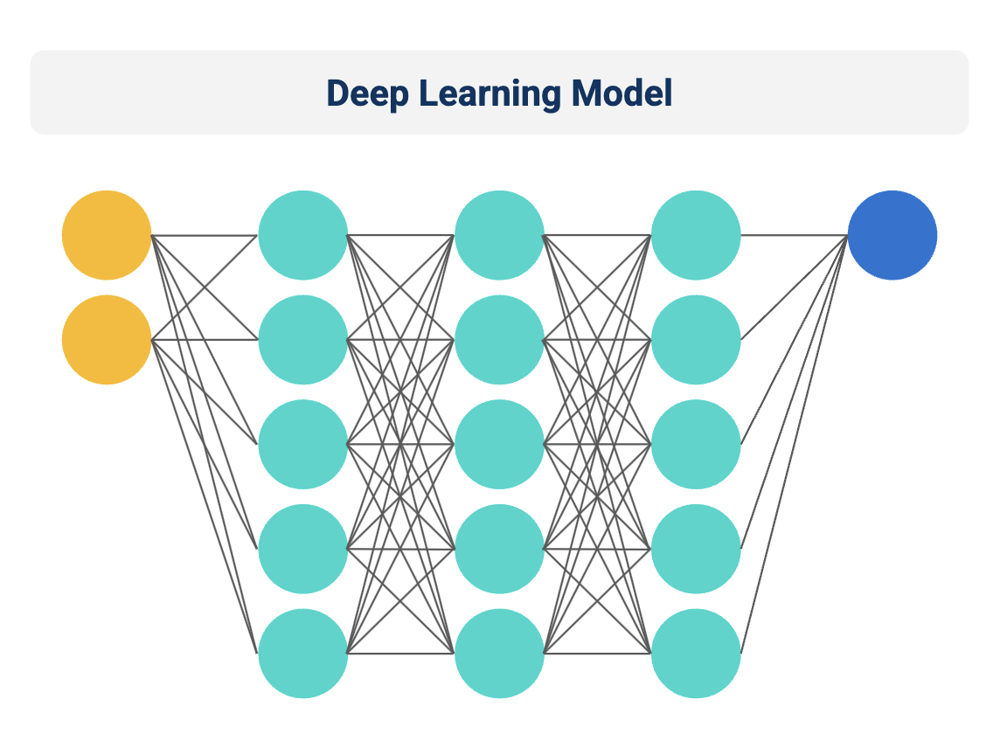
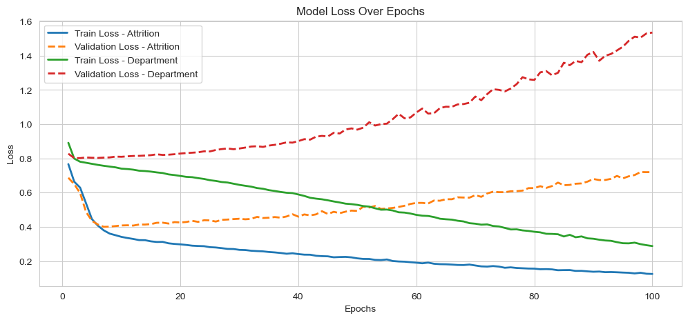
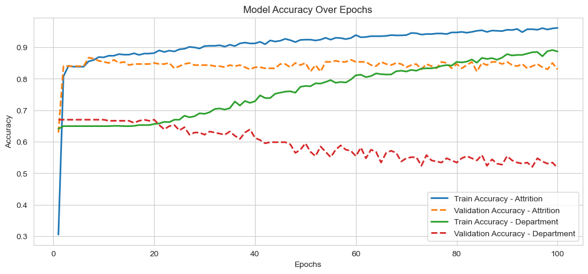

# Employee Retention & Department Optimization Model  



## Purpose  
The **Employee Retention & Department Optimization Model** is a deep learning solution designed to help HR departments predict:  

1. **Employee Attrition** – Identifying employees who may be at risk of leaving.  
2. **Optimal Department Fit** – Recommending the most suitable department for each employee.  

By leveraging Python, TensorFlow, and data analysis techniques, this project provides valuable insights to optimize workforce management, improve retention rates, and enhance employee job satisfaction.

This project simulates a real-world HR analytics scenario, enabling organizations to make data-driven decisions to maintain a productive and engaged workforce.

---

## Overview  
The **Employee Retention & Department Optimization Model** addresses key HR challenges:  

- **Reducing Employee Turnover** – Helps predict employees at risk of leaving to take proactive retention measures.  
- **Optimizing Workforce Allocation** – Assists in placing employees in the best-suited departments based on skills and attributes.  
- **Improving Job Satisfaction** – Ensures employees are assigned roles aligned with their strengths and career aspirations.  
- **Enhancing HR Decision-Making** – Uses AI-driven insights to streamline talent management strategies.  

Using a **branched neural network**, the model simultaneously predicts attrition risk and department suitability, allowing HR professionals to optimize both hiring and retention strategies.

---

## Table of Contents  

1. [Purpose](#purpose)  
2. [Overview](#overview)  
3. [Data Dictionary](#data-dictionary)  
4. [Project Structure](#project-structure)  
5. [Visualizations](#visualizations)  
   - [Loss Over Epochs](#loss-over-epochs)  
   - [Accuracy Over Epochs](#accuracy-over-epochs)  
6. [Use Cases](#use-cases)  
7. [Technologies Used](#technologies-used)  
8. [Installation and How to Use](#installation-and-how-to-use)  
9. [Recommendations](#recommendations)  
10. [Future Considerations](#future-considerations)  
11. [Conclusion](#conclusion)  

---

## Data Dictionary  

The dataset contains the following columns:  

| Column                  | Data Type  | Description                                                  |
|-------------------------|------------|--------------------------------------------------------------|
| `Age`                   | int64      | Employee's age.                                             |
| `Attrition`             | object     | Whether the employee left the company (Yes/No).             |
| `Department`            | object     | Employee’s current department.                              |
| `DistanceFromHome`      | int64      | Distance between home and work (miles).                     |
| `Education`            | int64      | Employee's highest level of education.                      |
| `JobSatisfaction`       | int64      | Employee’s job satisfaction level.                          |
| `OverTime`             | object     | Whether the employee works overtime (Yes/No).               |
| `StockOptionLevel`      | int64      | Number of stock options granted to the employee.            |
| `WorkLifeBalance`       | int64      | Employee’s perception of work-life balance.                 |
| `YearsAtCompany`        | int64      | Number of years at the company.                             |

### Dataset Summary  
- **Row Count**: 1,470 entries  
- **Memory Usage**: ~100 KB  
- **Non-null Count**: No missing values in selected features.  
- **Data Types**: Categorical (object) and numerical (int64).  

---

## Project Structure  

The project includes the following:  

- **models/**: Contains the trained deep learning model.  
- **notebooks/**: Jupyter Notebook (`attrition.ipynb`) with the full analysis and model training.  
- **images/**: Includes visualizations of model performance.  
- **README.md**: Documentation of the project.  
- **requirements.txt**: List of required Python libraries.  

---

## Visualizations  

### Loss Over Epochs  
  
- **Purpose**: Tracks model loss during training.  
- **Insight**: The loss for attrition prediction decreases steadily, while department classification loss fluctuates, suggesting further tuning might be beneficial.  

### Accuracy Over Epochs  
  
- **Purpose**: Monitors accuracy improvements for both outputs.  
- **Insight**: Attrition classification reaches high accuracy, while department classification remains lower, indicating the need for feature enhancements.  

---

## Use Cases  

This project has practical applications in HR analytics, including:  

1. **Employee Retention Strategies** – Identifies employees at risk of leaving, allowing HR to implement targeted retention efforts.  
2. **Optimized Talent Allocation** – Assigns employees to the most suitable departments based on their attributes.  
3. **Performance Management** – Helps understand factors contributing to job satisfaction and employee success.  
4. **Workforce Planning** – Assists in making informed hiring and training decisions.  

---

## Technologies Used  

- **Python** – Data processing and model development.  
- **TensorFlow/Keras** – Building and training the branched neural network.  
- **Pandas & NumPy** – Data manipulation and analysis.  
- **Scikit-learn** – Preprocessing and evaluation metrics.  
- **Seaborn & Matplotlib** – Data visualization.  

---

## Installation and How to Use  

### Installation Steps  

1. **Clone this repository**:  
   ```bash
   git clone https://github.com/jsaintfleur/neural-network-challenge-2.git

2. **Navigate to the Project Directory:**
```bash
   cd neural-network-challenge-2
```

3. **Install Dependencies: Install the required Python libraries by running:**

```python
# Import Libraries  

import pandas as pd  # Data manipulation and analysis  
import numpy as np  # Numerical computations and array handling  
import seaborn as sns  # Statistical visualizations  
import matplotlib.pyplot as plt  # General visualizations  

# TensorFlow and Keras for deep learning  
import tensorflow as tf  
from tensorflow.keras.layers import Dense, Input  # Neural network layers  
from tensorflow.keras.models import Model  # Functional API for branched neural networks  

# Scikit-learn for preprocessing, evaluation, and metrics  
from sklearn.model_selection import train_test_split  # Splitting dataset into training and testing sets  
from sklearn.preprocessing import StandardScaler, OneHotEncoder, LabelEncoder  # Encoding categorical variables and scaling features  
from sklearn.metrics import (classification_report, confusion_matrix, roc_curve,  
                              auc, precision_recall_curve)  # Model evaluation metrics  

from pathlib import Path  # Path handling  
```

4. **Launch the Jupyter Notebook: Open the project analysis notebook:**

``` bash
jupyter notebook
```
5. **Run the Analysis:** 
Open the `student_loans_with_deep_learning.ipynb` notebook and run the cells to view the analysis and visualizations.


**Prerequisites**
- Python 3.8 or higher
- Jupyter Notebook or JupyterLab
- A web browser to view the notebook

---


## Recommendations  

To enhance the model’s performance, consider:  

### Feature Engineering  
- Incorporate additional HR metrics such as employee satisfaction surveys and salary growth.  
- Introduce external factors such as industry trends and economic conditions.  

### Hyperparameter Tuning  
- Optimize neural network architecture (e.g., number of layers, neurons, activation functions).  
- Experiment with different optimizers and learning rates.  

### Class Imbalance Handling  
- If attrition cases are underrepresented, use techniques like **SMOTE** or **class weighting**.  

### Model Interpretability  
- Implement **SHAP values** to explain model predictions to HR teams.  

---

## Future Considerations  

To further improve this model, future enhancements could include:  

### Incorporating Additional Data  
- Employee feedback and sentiment analysis from HR surveys.  
- Job market conditions affecting employee retention.  

### Integration with HR Systems  
- Deploy the model as an **API** for real-time predictions.  
- Embed predictions in workforce planning tools.  

### Explainability and Bias Detection  
- Ensure fairness by analyzing if predictions disproportionately affect certain groups.  
- Use **LIME** or **SHAP** to interpret predictions.  

### Deep Learning Enhancements  
- Try more advanced architectures like **LSTMs** for time-based employee attrition trends.  
- Explore **transformer-based models** for improved classification.  

---

## Conclusion  

The **Employee Retention & Department Optimization Model** demonstrates the power of AI in HR analytics. By predicting both attrition risk and department suitability, this model can:  

✔️ **Enhance Employee Retention** – Identify at-risk employees before they leave.  
✔️ **Optimize Workforce Planning** – Ensure employees are in the right roles.  
✔️ **Support Data-Driven HR Decisions** – Reduce turnover costs and improve job satisfaction.  

By continuously improving and integrating this model into HR workflows, organizations can build a more engaged and productive workforce.  

---

[🔼 Back to Table of Contents](#table-of-contents)  
